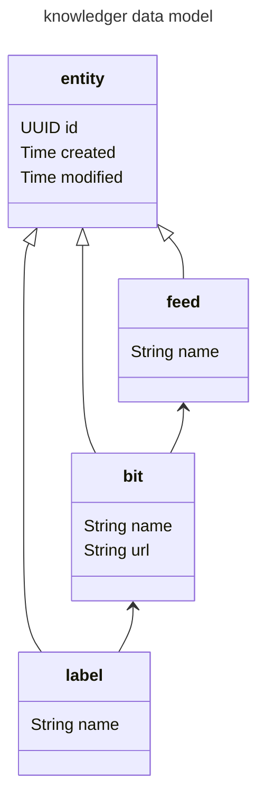

# knowledger
Helps to build up desired knowledge.

As a first step, it is possible to collect bits of interesting content in form of a url. Each bit is assigned to a feed, 
which can later be used to consume them piece by piece (e.g. a feed for podcasts, one for articles etc.).
Labels can be used for further structuring.

## Decisions

Technology and design decisions can be found in [the decision log](./decision_log).

## Data Model



## API

### Ideas:

check for easy generation of API

### Endpoints

#### common fields

for all entities

```json 
{
  "id": "3f0d778e-be1f-4412-949e-816fcbda4fde", // v4 UUID. Read-only, generated by backend.
  "created": "2024-11-20T14:52:17+00:00", // ISO 8601 timestamp. Read-only, generated by backend.
  "modified": "2024-11-20T14:52:17+00:00", // ISO 8601 timestamp. Read-only, generated by backend.
  "_links": {}, // Read-only, see https://en.wikipedia.org/wiki/Hypertext_Application_Language
  "_embedded": {}, // Read-only, optional, see https://en.wikipedia.org/wiki/Hypertext_Application_Language
}
```

#### /feeds

    GET POST /feeds
    GET PUT DELETE /feeds/{id}

```json 
{
  "url": "my feed name"
}
```

#### /feeds/{id}/bits

    GET POST /feeds/{id}/items
    GET PUT DELETE /feeds/{id}/items/{id}

```json 
{
  "name": "some bit name",
  "url": "https://some.int/eresting/content"
}
```

#### /feeds/{id}/bits/{id}/labels

    GET POST /feeds/{id}/items/{id}/labels
    GET DELETE /feeds/{id}/items/{id}/labels/{id}

```json 
{
  "name": "some label name"
}
```

#### /labels

    GET POST /labels
    GET PUT DELETE /labels/{id}

```json 
{
  "name": "some label name"
}
```

### Ordering

Not available in intial version, ordering is done by timestamp.

Thoughts:
- order is read-only
- moves are done via field 'afterId'

#### Options for order:

- rank / position <-
  - (-) "re-ranking" might be necessary when many changes occur (?)
  - (-) special solution needed for collisions
  - (+) rather stable, especially in a concurrent setup
  - Confluence and Trello do it like that

- linked list
  - (-) requires changing 2 entries
  - (-) deletion more complex
  - (-) possible issues with concurrent usage

- additional order list
  - (-) potential for all kinds of inconsistencies

### Conflict handling

Start with LLW, and later switch to a more elaborate version (e.g. OT)

Options:

- Optimistic Concurrency Control (OCC): Allows users to modify items concurrently and detects conflicts when changes are submitted.
- Last Write Wins (LWW): Accepts the most recent change based on timestamps, discarding earlier ones.
- Operational Transformation (OT): Automatically merges conflicting operations in real-time collaborative systems.
- Conflict-Free Replicated Data Types (CRDTs): Ensures conflict-free merging of concurrent changes across distributed systems.
- Mergeable Data Structures: Defines custom merging logic for conflicting changes.
- Manual Conflict Resolution: Provides users with the option to resolve conflicts themselves.
